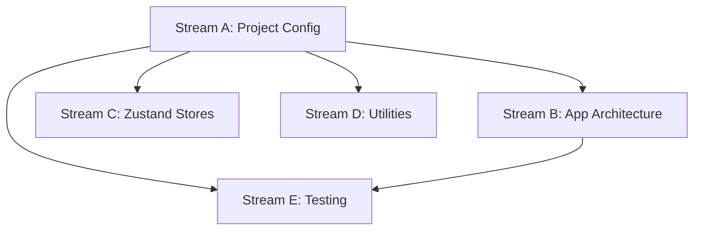

# Parallel Work Streams Analysis: 001-foundation-setup

## Overview

The foundation setup task involves migrating from SvelteKit to React+Vite+TypeScript while maintaining the same build output and development experience. This analysis breaks down the work into parallel streams that can be executed simultaneously by different agents.

## Parallel Work Streams for 001-foundation-setup

### Stream A: Project Configuration & Build Setup
- **Scope**: Initialize new React+Vite project structure, configure build pipeline, and set up development environment
- **Files**: 
  - `vite.config.ts` (new React configuration)
  - `package.json` (dependency updates and script changes)
  - `tsconfig.json` (React-specific TypeScript config)
  - `.eslintrc.js` (React ESLint rules)
  - `prettier.config.js`
  - `tailwind.config.js` (updates for React)
  - `postcss.config.cjs`
- **Dependencies**: None (can start immediately)
- **Estimated Time**: 4 hours

### Stream B: Core Application Architecture
- **Scope**: Set up React app structure, routing, and main layout components
- **Files**: 
  - `src/App.tsx` (root component)
  - `src/main.tsx` (entry point)
  - `src/index.html` (HTML template)
  - `src/components/Layout/` (main layout components)
  - `src/pages/` (route components)
  - React Router setup
- **Dependencies**: Stream A (needs Vite config and dependencies)
- **Estimated Time**: 3 hours

### Stream C: Zustand Store Foundation
- **Scope**: Set up Zustand store structure and migrate core state management logic
- **Files**: 
  - `src/stores/` (all store files)
  - `src/stores/index.ts` (store exports)
  - `src/stores/stateStore.ts` (main state store)
  - `src/stores/inputStateStore.ts` (input state)
  - `src/hooks/` (custom React hooks for stores)
- **Dependencies**: Stream A (needs dependencies installed)
- **Estimated Time**: 5 hours

### Stream D: Utility Migration & TypeScript Setup
- **Scope**: Migrate utility functions and TypeScript definitions from Svelte to React-compatible versions
- **Files**: 
  - `src/utils/` (migrate from `src/lib/util/`)
  - `src/types/` (migrate from `src/lib/types.d.ts`)
  - `src/constants.ts` (migrate from `src/lib/constants.ts`)
  - Environment variable handling
  - Serialization utilities
- **Dependencies**: Stream A (needs TypeScript config)
- **Estimated Time**: 3 hours

### Stream E: Testing Infrastructure
- **Scope**: Set up testing environment for React components and utilities
- **Files**: 
  - `vitest.config.ts` (React-specific test config)
  - `src/tests/setup.ts` (test setup for React)
  - `playwright.config.ts` (updates for React app)
  - Test utility files
- **Dependencies**: Stream A (needs Vite config), Stream B (needs app structure)
- **Estimated Time**: 2 hours

## Sequential Dependencies

## Coordination Notes

1. **Stream A must complete first** - All other streams depend on the basic project configuration and dependencies being in place

2. **Shared file conflicts**: 
   - `package.json` - Only Stream A should modify this
   - `tsconfig.json` - Only Stream A should modify this initially
   - `vite.config.ts` - Only Stream A should own this file

3. **Communication points**:
   - Stream A should announce when dependencies are installed and basic config is ready
   - Stream C should coordinate with Stream D on shared type definitions
   - Stream B should coordinate with Stream C on state integration points

4. **File organization**:
   - All new React files go in `src/` following the new structure
   - Keep existing Svelte files in place until migration is complete
   - Use temporary `.new` suffixes for files that will replace existing ones

## Success Criteria

### Development Environment
- [ ] `npm run dev` starts React development server on port 3000
- [ ] Hot module replacement works for React components
- [ ] TypeScript compilation passes with zero errors
- [ ] ESLint passes with current code standards

### Build Process
- [ ] `npm run build` generates static site in `docs/` directory
- [ ] Bundle size is documented and comparable to current SvelteKit build
- [ ] All environment variables with `MERMAID_` prefix are supported
- [ ] Static site generation works correctly for GitHub Pages

### Code Quality
- [ ] TypeScript strict mode enabled and passing
- [ ] All utility functions migrated and working
- [ ] Prettier formatting configured and working
- [ ] Git hooks and lint-staged working correctly

### Testing
- [ ] Unit test framework (Vitest) working with React components
- [ ] E2E tests (Playwright) updated for React app structure
- [ ] Test coverage reporting functional
- [ ] All test scripts in package.json working

## Risk Mitigation

1. **Dependency conflicts**: Stream A should use exact versions that are known to work together
2. **Bundle size regression**: Monitor and document bundle size changes throughout migration
3. **Development experience**: Ensure HMR and dev server performance matches current experience
4. **Build compatibility**: Verify static site generation produces identical output structure

## Next Steps After Completion

Once all streams are complete and success criteria are met:
1. Verify the entire application builds and runs correctly
2. Run full test suite to ensure no regressions
3. Document any architectural changes or new patterns
4. Prepare for component migration phase (next epic task)